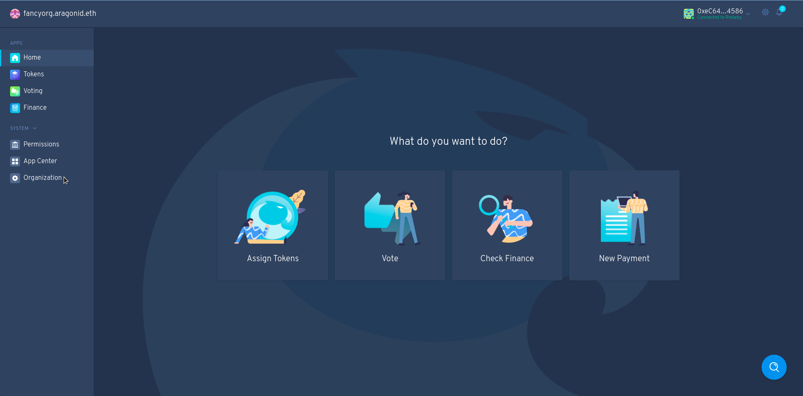
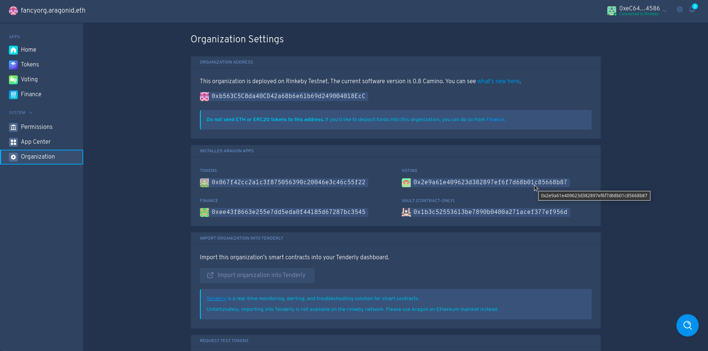

# Membership Checker Contracts
## Aragon DAO
The Aragon DAO membership checker uses the Aragon Voting app, or the TokenMembership app contracts.

### How to get the Voting App or TokenMembership contract address
You can get app addresses through the aragon dao client interface, with the aragon-connect package, or by checking the events emitted when the DAO instance is created.
#### How to get App address through Aragon Client Interface
- Navigate to the Aragon client [client.aragon.org](https://client.aragon.org) and open or create your DAO
- Click on `Organization` under `System` in the sidebar
  <div>
  
  </div>
- Under `Installed Aragon Apps`, look for `Tokens` or `Voting` and copy the address 
  <div>
  
  </div>

#### How to get App address using aragon-connect package (Node.js)
- Install aragon-connect npm package
- Use the following code to retreive the app
```
import connect from '@aragon/connect'
import connectTokens from '@aragon/connect-tokens'

const org = await connect('myorg.aragonid.eth', 'thegraph')
const tokens = await connectTokens(org.app('token-manager'))
// tokens.address
```

#### How to get App address manually
- Navigate to the kernel (dao) contract etherscan.
- Click the `Events` tab
- Find the `NewAppProxy` events. You can either scan the page for the events, or click the search button and  paste in the following text `0xd880e726dced8808d727f02dd0e6fdd3a945b24bfee77e13367bcbe61ddbaf47`
- Scan for an event with `appId = 0x6b20a3010614eeebf2138ccec99f028a61c811b3b1a3343b6ff635985c75c91f` (TokenManager) or `appId = 0x9fa3927f639745e587912d4b0fea7ef9013bf93fb907d29faeab57417ba6e1d4` (Voting App)
