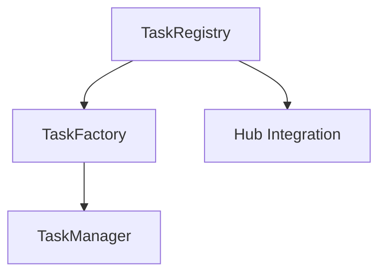
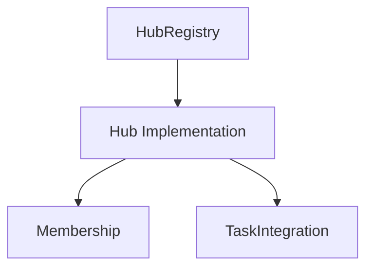
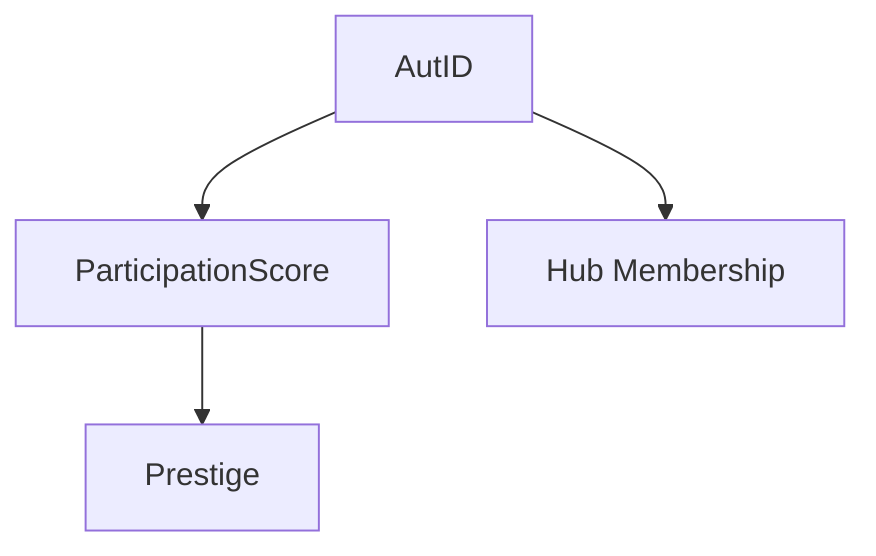

# Current System Analysis

## Core Components

### 1. Task & Contribution System


**Key Features:**
1. **TaskRegistry**
- Central registry of all valid tasks
- Owner-controlled task registration
- Task verification system

2. **TaskFactory**
- Creates task contributions
- Manages descriptions
- Handles task points

3. **TaskManager**
- Tracks task completion
- Manages contribution status
- Handles point distribution

**Core Flow:**
1. Tasks registered in TaskRegistry
2. TaskFactory creates contributions
3. TaskManager tracks completion

### 2. Hub System


**Key Features:**
1. Membership management
2. Role-based access
3. Commitment tracking
4. Task integration

### 3. Identity & Reputation


**Key Features:**
1. Non-transferable identity
2. Participation tracking
3. Cross-hub reputation
4. Value measurement

## Current Integration Points

1. **Task-Hub Integration**
```solidity
// Current pattern in Hub
function joinHub(uint256 role, uint8 commitment, address hub)
function createRecordAndJoinHub(...)
```

2. **Task-Reputation Integration**
```solidity
// TaskManager tracks contributions for:
- Point allocation
- Participation score
- Value measurement
```

