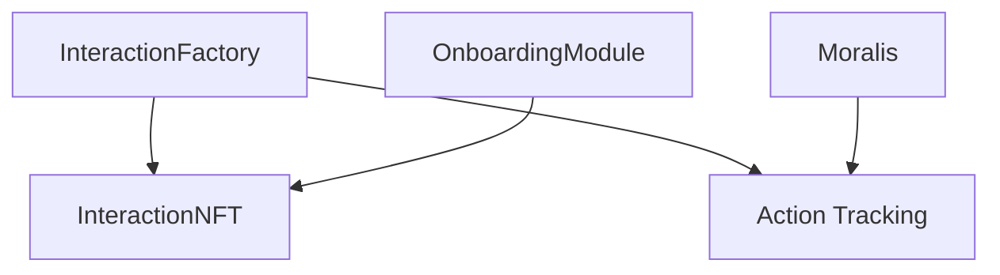
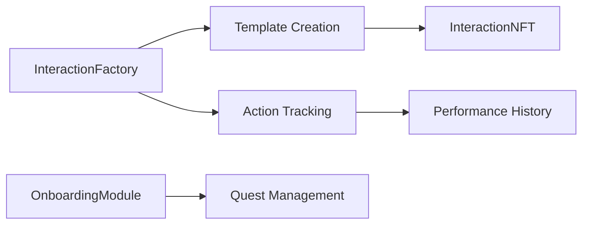
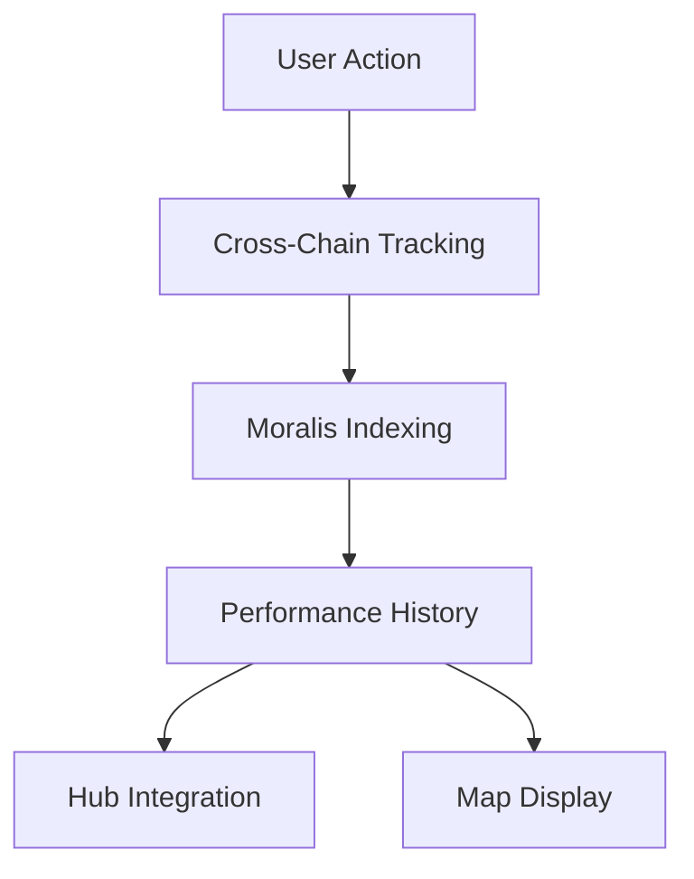
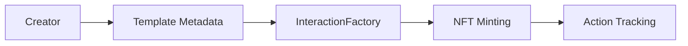
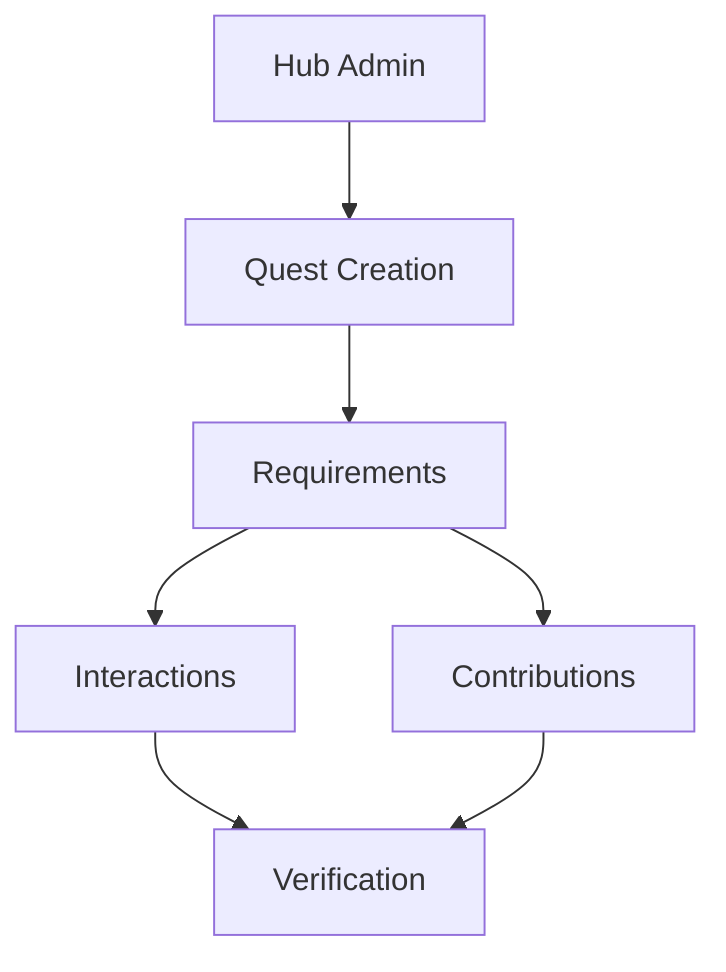
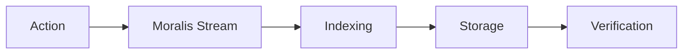
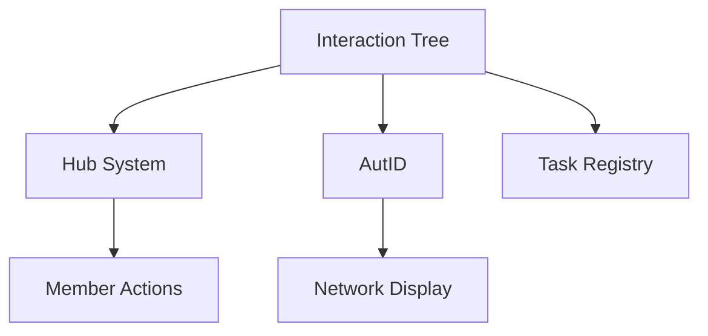
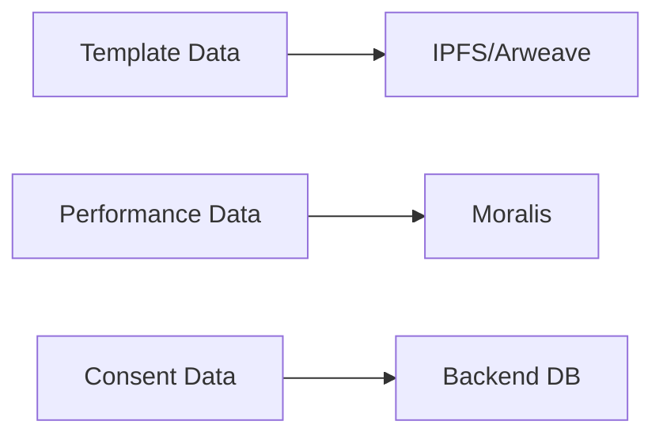
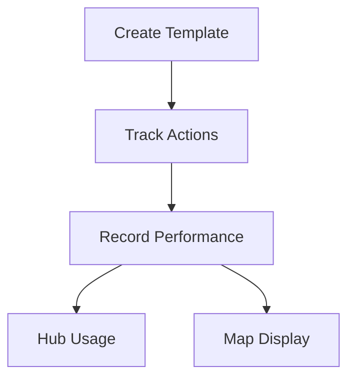
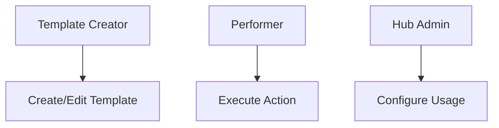

# Interaction Tree: System Architecture

## Core System Architecture

## Contract Relationships

## Data Flow Architecture

## Template Creation Flow

## Onboarding Architecture

## Cross-Chain Tracking

## Integration Points

## Storage Architecture

## User Flow

## Permission Structure

