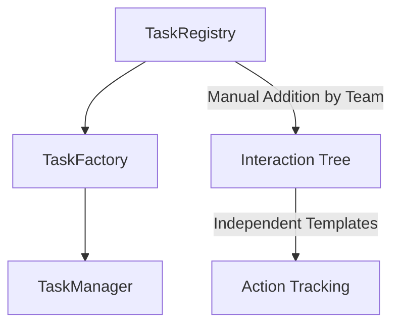
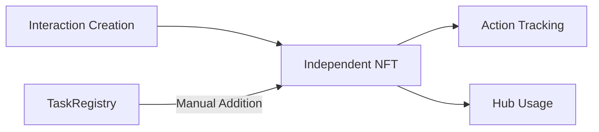

# Interaction Tree: System Integration

## Integration with Existing System

### 1. Key Integration Points

Current Task System:

The Interaction Tree:
1. Creates independent interaction templates
2. Tracks actions across chains
3. Exists independently of TaskRegistry

### 2. Data Flow

### 3. Context Integration

Contexts map to existing components:
1. Hub Usage → TaskManager
2. Map Usage → AutID
3. Onboarding → Membership

The system operates independently, with TaskRegistry integration being a separate, manual process handled by your team.

This creates a clean separation where:
- Interaction Tree focuses on template creation and tracking
- Your team handles TaskRegistry additions
- Hubs utilize registered interactions as needed

